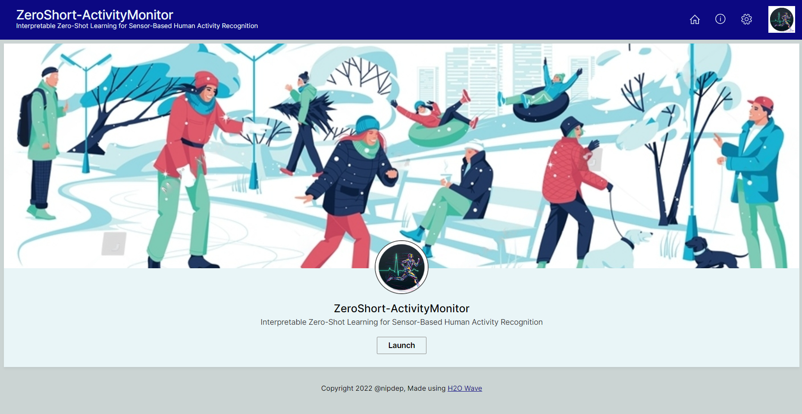
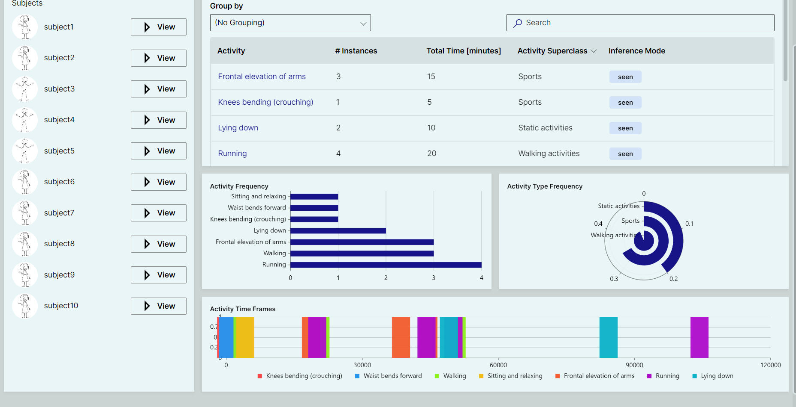

<h1 align='center'>
    
    
</h1>
<h2 align='center'> ZeroShot-ActivityMonitor </h2>

### Introduction
"Interpretable Zero-Shot Learning for Sensor-Based Human Activity Recognition," offers a comprehensive solution for accurately recognizing and interpreting human activities using sensor data. Our intuitive and user-friendly visualization dashboard allows users to analyze and interpret activity patterns effortlessly, leveraging state-of-the-art zero-shot learning techniques. Gain valuable insights into sensor-based human activity recognition, understand complex activity relationships, and unlock the power of interpretable AI for a deeper understanding of human behavior.

### Installation 
1. Setup python virtual environment [$ run the command in the terminal under current folder dir]
   `python -m venv venv`
2. Activate newly created python env
   `venv/Scripts/activate`
3. Install main libraries
   `pip install -r requirements.txt`

### Run Application 
1. Activate built python env.
   `venv/Scripts/activate`
2. Run the application 
   `wave run app.app`
3. View Application at you browser
   `http://localhost:10101/`
*`ctrl + c` for shutdown the application

### Functionalities  

> Home page

> Activity Dashboard page

